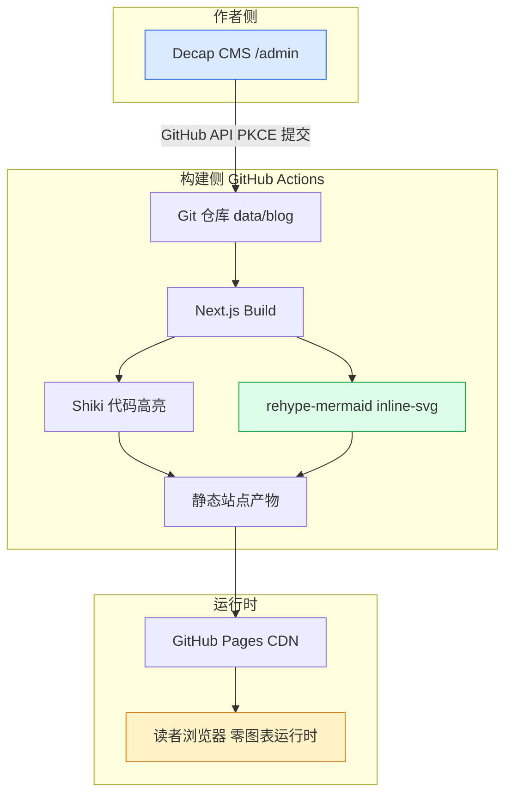

---
title: '渲染管线验证：Shiki × Mermaid'
date: '2026-06-18'
tags: ['shiki', 'mermaid', 'cpp']
draft: true
summary: '验证 rehype-pretty-code（Shiki）代码高亮与 rehype-mermaid 构建期内联 SVG 渲染的端到端管线。'
---

## 一、C++ 算法题解（Shiki 高亮验证）

经典「环形链表 II」（LeetCode 142）的快慢双指针解法。此代码块由 rehype-pretty-code
通过 Shiki 在构建期着色，复用 VS Code 的 TextMate 语法，关键字、类型、数字应各有颜色：

```cpp
/**
 * Definition for singly-linked list.
 */
struct ListNode {
    int val;
    ListNode *next;
    ListNode(int x) : val(x), next(nullptr) {}
};

class Solution {
public:
    ListNode *detectCycle(ListNode *head) {
        ListNode *slow = head, *fast = head;
        while (fast && fast->next) {
            slow = slow->next;
            fast = fast->next->next;
            if (slow == fast) {
                ListNode *ptr = head;
                while (ptr != slow) {
                    ptr = ptr->next;
                    slow = slow->next;
                }
                return ptr;
            }
        }
        return nullptr;
    }
};
```

## 二、Python 数据处理（验证多语言高亮）

```python
from typing import Iterable
from collections import Counter

def word_frequency(text: str, top_n: int = 5) -> list[tuple[str, int]]:
    words: Iterable[str] = (w.strip(",.!?;:\"'()[]").lower() for w in text.split())
    return Counter(filter(None, words)).most_common(top_n)

if __name__ == "__main__":
    sample = "the quick brown fox jumps over the lazy dog the the the"
    print(word_frequency(sample))
```

## 三、系统架构流程图（构建期 Mermaid 到 内联 SVG）

下图在构建期由 rehype-mermaid 通过无头 Chromium 渲染为内联 SVG，
运行时不引入任何 mermaid.js 客户端运行时。



## 四、行高亮验证（rehype-pretty-code 元语法）

下方代码块用 `{2,5}` 标记第 2 行与第 5 行高亮，验证 Shiki 的行级标注：

```js {2,5}
function greet(name) {
  const message = 'Hello, ' + name + '!'
  console.log(message)
  return message
}
```
