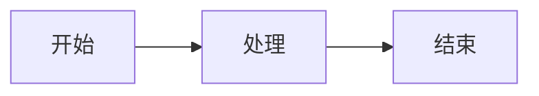

# 博客调试与使用指南

## 项目简介

本项目是一个基于 Next.js 15 + Tailwind CSS 4 + Contentlayer 的个人博客，支持 MDX 内容、代码高亮（Shiki）、Mermaid 图表、暗色主题切换等功能。

## 环境要求

- **Node.js**：20 或更高版本（推荐 20 LTS）
- **npm**：10+（随 Node.js 安装）
- **操作系统**：Windows / macOS / Linux

> ⚠️ Node.js 18 会触发多个依赖的 engine warning，强烈建议升级到 20+。

## 安装依赖

```bash
npm install
```

安装过程会自动下载 Playwright Chromium（用于 Mermaid 图表的构建期渲染）。

如果 Chromium 下载失败，可手动执行：

```bash
npx playwright-core install chromium
```

## 本地开发启动

```bash
npm run dev
```

浏览器访问 http://localhost:3000 即可预览。

## 常用命令

| 命令                    | 说明                                          |
| ----------------------- | --------------------------------------------- |
| `npm run dev`           | 启动本地开发服务器                            |
| `npm run build`         | 静态构建（输出到 `./out`，用于 GitHub Pages） |
| `npm run build:dynamic` | 动态构建（非静态导出模式）                    |
| `npm run serve`         | 启动构建产物预览服务器                        |
| `npm run lint`          | ESLint 代码检查                               |
| `npx decap-server`      | 启动 Decap CMS 本地代理（配合 `/admin` 使用） |

## 目录说明

```
├── app/                    # Next.js App Router 页面
│   ├── layout.tsx          # 根布局（Header/Footer/主题/分析）
│   ├── page.tsx            # 首页（最新文章列表）
│   ├── Main.tsx            # 首页主体组件
│   ├── blog/               # 博客列表页
│   ├── projects/           # 项目展示页
│   └── about/              # 关于页
├── components/             # React 组件
│   ├── Header.tsx          # 导航头部
│   ├── MDXComponents.tsx   # MDX 自定义组件
│   └── ...
├── css/
│   ├── tailwind.css        # Tailwind 入口
│   └── prism.css           # 代码块样式（Shiki 明暗切换）
├── data/
│   ├── siteMetadata.js     # ★ 站点配置（标题/描述/社交链接等）
│   ├── headerNavLinks.ts   # 导航菜单
│   ├── projectsData.ts     # 项目数据
│   ├── authors/            # 作者信息（MDX）
│   └── blog/               # 博客文章（MDX/MD）
├── lib/
│   └── rehype-pretty-code-options.ts  # Shiki 高亮配置
├── contentlayer.config.ts  # Contentlayer 配置（MDX 管线）
├── next.config.js          # Next.js 配置
├── public/
│   ├── admin/              # Decap CMS 后台
│   └── static/             # 静态资源（图片/图标等）
├── scripts/                # 构建后脚本（标签统计/搜索索引）
└── docs/                   # 项目文档
```

## 如何修改站点信息

编辑 `data/siteMetadata.js`，修改以下字段：

```js
const siteMetadata = {
  title: '我的博客', // 站点标题（浏览器标签页显示）
  author: '博主', // 作者名称
  headerTitle: '我的博客', // 导航栏显示的标题
  description: '...', // 站点描述（首页和 SEO）
  siteUrl: 'https://...', // 部署后的域名
  language: 'zh-cn', // 语言
  locale: 'zh-CN', // 区域
  // 社交链接（不需要的留空字符串即可）
  email: '',
  github: '',
}
```

> 💡 社交链接留空字符串 `''` 即可，不会在页面上显示无效链接。

## 如何新增博客文章

### 方法一：直接创建文件

在 `data/blog/` 目录下创建 `.mdx` 或 `.md` 文件：

```markdown
---
title: '文章标题'
date: '2026-07-01'
tags: ['标签1', '标签2']
draft: false
summary: '文章摘要，会显示在列表页。'
---

正文内容...
```

### 方法二：通过 Decap CMS 后台

1. 启动本地代理：`npx decap-server`
2. 访问 http://localhost:3000/admin
3. 在后台界面中创建和编辑文章

### Frontmatter 字段说明

| 字段      | 必填 | 说明                             |
| --------- | ---- | -------------------------------- |
| `title`   | 是   | 文章标题                         |
| `date`    | 是   | 发布日期（YYYY-MM-DD）           |
| `tags`    | 否   | 标签列表                         |
| `draft`   | 否   | 设为 `true` 则不会在生产环境显示 |
| `summary` | 否   | 文章摘要                         |
| `authors` | 否   | 作者列表（默认使用 default）     |
| `layout`  | 否   | 布局样式（默认 PostLayout）      |

## MDX 写法示例

### 普通 Markdown

标准的 Markdown 语法全部支持，包括标题、列表、表格、链接、图片等。

### 代码块（Shiki 高亮）

````markdown
```python
def hello():
    print("Hello, World!")
```
````

支持行高亮：

````markdown
```js {2,4}
function example() {
  const a = 1 // 这行会高亮
  const b = 2
  const c = 3 // 这行也会高亮
}
```
````

支持高亮单词：

````markdown
```js
const message = 'hello' // [!highlight message]
```
````

### Mermaid 图表

在 raw 模式下用围栏代码块输入：

````markdown

````

> ⚠️ Mermaid 图表在构建期由无头 Chromium 渲染为内联 SVG，运行时不会加载 mermaid.js。
> 如果本地构建时 Mermaid 失败，请确保已安装 Playwright Chromium。

### 数学公式

行内公式：`$E = mc^2$`

块级公式：

```markdown
$$
\int_{0}^{\infty} e^{-x^2} dx = \frac{\sqrt{\pi}}{2}
$$
```

### 引用块警告

```markdown
> [!NOTE]
> 这是一个提示。

> [!WARNING]
> 这是一个警告。
```

## `/admin` 后台配置说明

Decap CMS 配置文件位于 `public/admin/config.yml`。

### 需要用户替换的配置项

| 配置项           | 当前值                                | 说明                          |
| ---------------- | ------------------------------------- | ----------------------------- |
| `backend.repo`   | `yourname/yourname.github.io`         | 你的 GitHub 仓库 `owner/repo` |
| `backend.app_id` | `Iv1.xxxxxxxxxxxxxxxx`                | GitHub OAuth App Client ID    |
| `site_url`       | `https://yourname.github.io`          | 你的站点地址                  |
| `display_url`    | `https://yourname.github.io`          | 显示的站点地址                |
| `logo_url`       | `https://yourname.github.io/logo.svg` | 后台 Logo 地址                |

### 配置步骤

1. 在 GitHub 创建 OAuth App（https://github.com/settings/developers）
2. Authorization callback URL 填：`https://api.decap.green/oauth/callback`
3. 将 Client ID 填入 `config.yml` 的 `app_id` 字段
4. 将仓库地址填入 `backend.repo` 字段

### 本地联调

```bash
# 终端 1：启动 Decap 本地代理
npx decap-server

# 终端 2：启动 Next.js 开发服务器
npm run dev

# 浏览器访问 http://localhost:3000/admin
```

## 静态构建与 GitHub Pages 部署

### 本地构建

```bash
EXPORT=1 UNOPTIMIZED=1 npm run build
```

构建产物输出到 `./out` 目录。

### GitHub Pages 自动部署

项目已配置 `.github/workflows/pages.yml`，推送到 `main` 分支后会自动：

1. 安装依赖（`npm ci`）
2. 安装 Playwright Chromium（Mermaid 渲染需要）
3. 静态构建
4. 部署到 GitHub Pages

> 💡 在仓库 Settings → Pages 中，将 Source 设为 "GitHub Actions"。

## 常见问题排查

### Node 版本过低

**现象**：安装时出现大量 `EBADENGINE Unsupported engine` 警告。

**解决**：升级到 Node.js 20 或更高版本。

```bash
# 检查当前版本
node -v

# 推荐使用 nvm 管理版本
nvm install 20
nvm use 20
```

### Mermaid 构建失败

**现象**：构建时报错 `Failed to launch browser` 或类似 Chromium 相关错误。

**解决**：

```bash
npx playwright-core install --with-deps chromium
```

如果在 CI 环境中，确保 workflow 包含此步骤（已配置）。

### 搜索索引未更新

**现象**：搜索找不到新文章。

**解决**：重新运行 `npm run build`，构建脚本会自动生成 `public/search.json`。

### 图片路径问题

**现象**：图片在本地开发正常，部署后不显示。

**解决**：

- 图片放在 `public/static/images/` 目录下
- 引用时使用 `/static/images/xxx.png`（不包含 `public`）
- 如果使用 basePath，确保路径包含 basePath 前缀

### package-lock / yarn.lock 混用

**现象**：依赖安装不一致或报错。

**解决**：

- 本项目推荐使用 **npm**
- CI workflow 已配置 `npm ci`
- 如果存在 `yarn.lock` 且不使用 yarn，可以删除它
- 不要同时维护两个锁文件

### 构建时 Contentlayer 报错

**现象**：MDX 解析失败或内容不更新。

**解决**：

- 删除 `.contentlayer` 目录后重新构建
- 检查 MDX 文件的 frontmatter 格式是否正确
- 确保必填字段（`title`、`date`）已填写
